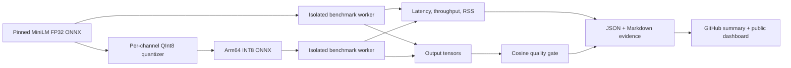

# Architecture

ArmForge CI separates orchestration from measurement. Each model runs in a fresh Python process,
which prevents the first session's allocator and memory maps from contaminating the second model's
RSS evidence. Both workers receive identical, seeded token tensors.

The default model is checksum-pinned. A digest mismatch fails before any benchmark begins. ONNX
Runtime graph optimizations remain enabled for both models, while the only model-level change is
per-channel signed INT8 dynamic quantization.

